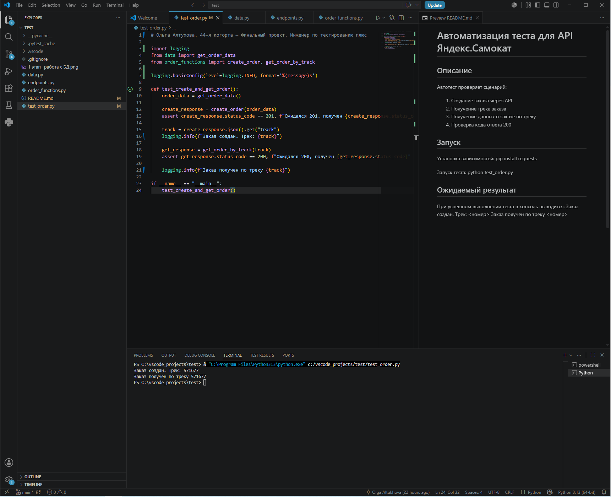
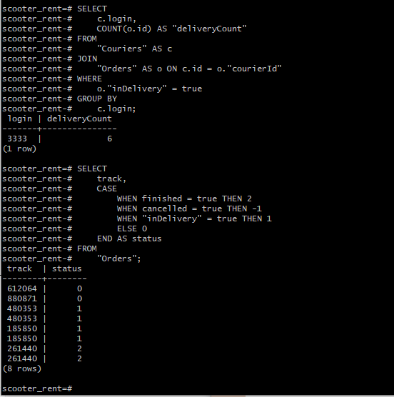


# Автоматизация теста для API Яндекс.Самокат

## Описание

Автотест проверяет сценарий:
1. Создание заказа через API
2. Получение трека заказа
3. Получение данных о заказе по треку
4. Проверка кода ответа 200

## Структура проекта

- `data.py` — тело запроса (данные для заказа)
- `endpoints.py` — эндпоинты API
- `order_functions.py` — функции создания и получения заказа
- `test_order.py` — автотест

## Запуск

Установка зависимостей:
pip install requests

Запуск теста:
python test_order.py

## Ожидаемый результат

При успешном выполнении теста в консоль выводится:
Заказ создан. Трек: <номер>
Заказ получен по треку <номер>



# Работа с базой данных

## Задание 1. Список курьеров с заказами в доставке
#### Запрос:
```sql
SELECT
    c.login,
    COUNT(o.id) AS "deliveryCount"
FROM "Couriers" AS c
JOIN "Orders" AS o ON c.id = o."courierId"
WHERE o."inDelivery" = true
GROUP BY c.login;
```
#### Результат: 
```sql
login   deliveryCount 
3333    6
```
Вывод: у курьера с логином 3333 есть 6 заказов в статусе «В доставке».

## Задание 2. Трекеры заказов и их статусы
#### Запрос:
```sql
SELECT
    track,
    CASE
        WHEN finished = true THEN 2
        WHEN cancelled = true THEN -1
        WHEN "inDelivery" = true THEN 1
        ELSE 0
    END AS status
FROM "Orders";
```

#### Результат:

```sql
track	status
612064	0
880871	0
480353	1
480353	1
185850	1
185850	1
261440	2
261440	2

Расшифровка статусов:

Статус	Значение
0	Заказ создан
1	В доставке
2	Завершён
-1	Отменён
```

Вывод: статусы заказов в базе данных определяются корректно.

